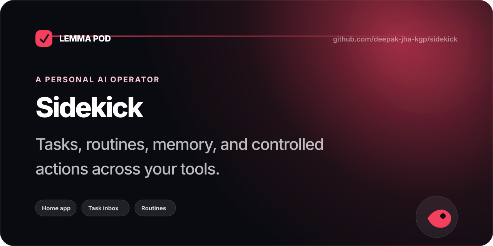
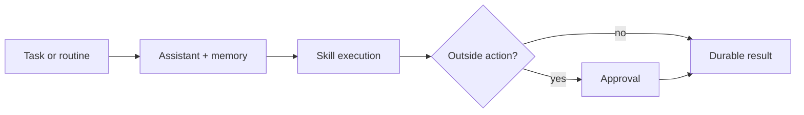

<p align="center">
  
</p>

<p align="center">
  <a href="https://lemma.work"></a>
  
  
</p>

<p align="center">
  <strong>Tasks, routines, memory, and controlled actions across your tools.</strong><br/>
  <sub>A user-named assistant that does recurring work, learns preferences, and proposes outside actions for approval.</sub>
</p>


## The product loop

<table>
  <tr>
    <td align="center" width="25%">
      <strong>01</strong><br/>
      Ask or schedule
    </td>
    <td align="center" width="25%">
      <strong>02</strong><br/>
      Plan with memory + skills
    </td>
    <td align="center" width="25%">
      <strong>03</strong><br/>
      Run the work
    </td>
    <td align="center" width="25%">
      <strong>04</strong><br/>
      Review result or approve action
    </td>
  </tr>
</table>



## Why this is a Lemma pod

<table>
<tr>
    <td width="50%" valign="top">
      <h3>A visible work queue</h3>
      <p>Tasks move from request to execution to a durable result you can inspect.</p>
    </td>
    <td width="50%" valign="top">
      <h3>Routines that run</h3>
      <p>Recurring intent becomes scheduled work rather than another reminder to yourself.</p>
    </td>
  </tr>
<tr>
    <td width="50%" valign="top">
      <h3>Learned context</h3>
      <p>Useful preferences and facts compound into explicit, editable memory.</p>
    </td>
    <td width="50%" valign="top">
      <h3>Controlled action</h3>
      <p>Outside actions are proposed first and executed only through an approval boundary.</p>
    </td>
  </tr>
</table>

This repository is a complete Lemma pod bundle: state, agent instructions, deterministic functions, workflows or schedules, permissions, application metadata, and the interface people actually use. The useful unit is the running system—not an isolated prompt or demo page.

## What is inside

| Layer | Role |
| --- | --- |
| **App** | The calm, purpose-built surface people operate |
| **Agents** | Judgment, research, drafting, or review with explicit instructions |
| **Tables** | Durable state that survives every conversation and run |
| **Functions** | Deterministic writes and guarded side effects |
| **Workflows / schedules** | The continuing loop that notices and acts |
| **Files** | Native knowledge and artifacts when the pod needs them |

## Run it

### Import the pod

```bash
git clone https://github.com/deepak-jha-kgp/sidekick.git
cd sidekick

lemma pods import . --dry-run
lemma pods import .
```

Connector accounts, credentials, member IDs, live records, and uploaded file bytes are intentionally not stored in this repository. Configure those in your own Lemma environment after import.

### Build the app

```bash
cd app
npm install
npm run build
```

## Repository map

```text
.
├── pod.json                 # pod identity
├── tables/                  # durable state
├── functions/               # deterministic operations
├── agents/                  # specialist instructions + permissions
├── workflows/               # multi-step processes, when used
├── schedules/               # time/event triggers, when used
├── apps/                    # deployed application bundle
├── app/                     # editable application source
├── docs/                    # visuals + implementation notes
└── README.md
```

Not every pod needs every resource type. The bundle only includes the machinery required by this product loop.

## Trust boundary

- Agent work lands in durable, inspectable state.
- Sensitive outside actions remain guarded by application or approval logic.
- Credentials and connected accounts never belong in the repository.
- Human decisions are part of the system, not an exception path.

## Go deeper

- [Implementation notes](./docs/implementation-notes.md)
- [Social card source](./docs/social-preview.svg)
- [Build on Lemma](https://lemma.work)

## Share

<p>
  <a href="https://twitter.com/intent/tweet?text=Sidekick%20%E2%80%94%20Tasks%2C%20routines%2C%20memory%2C%20and%20controlled%20actions%20across%20your%20tools.&url=https%3A%2F%2Fgithub.com%2Fdeepak-jha-kgp%2Fsidekick"></a>
  <a href="https://www.linkedin.com/sharing/share-offsite/?url=https%3A%2F%2Fgithub.com%2Fdeepak-jha-kgp%2Fsidekick"></a>
  <a href="https://bsky.app/intent/compose?text=Sidekick%20%E2%80%94%20Tasks%2C%20routines%2C%20memory%2C%20and%20controlled%20actions%20across%20your%20tools.%20https%3A%2F%2Fgithub.com%2Fdeepak-jha-kgp%2Fsidekick"></a>
</p>

---

<p align="center">
  <sub>People use the app. Agents work through the system. The result stays.</sub>
</p>
