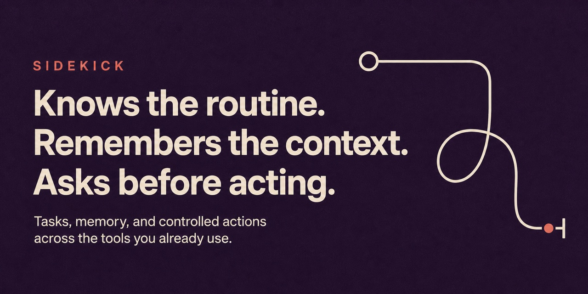

<p align="center">
  
</p>

<p align="center">
  <a href="https://lemma.work/import/github/deepak-jha-kgp/sidekick"></a>
  <a href="https://github.com/deepak-jha-kgp/sidekick/fork"></a>
</p>

<p align="center">A personal assistant that remembers how you work, handles recurring tasks, and asks before it acts outside the pod.</p>

## Why it exists

A useful assistant should not need the same background every morning. It should remember the routines you have taught it, know which details matter to you, and be clear about what it plans to do.

Sidekick keeps that memory and those routines in one place. It can prepare work on its own, but outside actions remain visible and reviewable.

## What it does

- Keep a list of tasks, recurring routines, preferences, and useful memory.
- Run a task with the assistant that belongs to this pod.
- Turn repeated behavior into a routine instead of another prompt you must remember.
- Prepare actions for connected tools and show them before execution.
- Distill completed work into memory the assistant can use next time.

## What a normal use looks like

Every weekday morning, Sidekick checks the inbox items you care about and prepares a short briefing. It remembers that investor mail goes first and newsletters do not. If a reply is needed, it proposes the action and waits.

## How it is built on Lemma

This repository contains the pod itself, not just a screenshot or a prompt. The interface and the parts that do the work are installed together.

- `app/` and `apps/home/` — The assistant home people use, with the packaged app Lemma installs.
- `tables/` — The assistant's name, tasks, routines, memory, emails, skills, and proposed actions.
- `agents/` — One agent handles the work; another turns completed work into compact, reusable memory.
- `functions/` — Fetch inbox items, apply results, update memory, and execute an approved action.
- `workflows/` and `schedules/` — Run a new task and distill useful memory when new work arrives.

The files in this repo contain the structure and instructions. Your private records, connected accounts, credentials, and deployed URLs are added after import.

## Run it on Lemma

<p>
  <a href="https://lemma.work/import/github/deepak-jha-kgp/sidekick"></a>
</p>

The button opens Lemma's import flow for this exact GitHub repository:

`https://lemma.work/import/github/deepak-jha-kgp/sidekick`

Name the assistant, add one real routine, and connect only the tools you want it to use. The repo contains no personal memory, mail, or account credentials.

<details>
<summary>Import from the command line</summary>

```bash
git clone https://github.com/deepak-jha-kgp/sidekick.git
cd sidekick

lemma pods import . --dry-run
lemma pods import .
```

</details>

## Make it yours

You do not need to keep this pod exactly as it is.

1. [Fork the repository](https://github.com/deepak-jha-kgp/sidekick/fork).
2. Change the instructions, app, tables, or rules for the way you work.
3. Import your fork with `https://lemma.work/import/github/<your-github-name>/<your-repo>`.
4. When it is useful, [show your version here](https://github.com/deepak-jha-kgp/sidekick/issues/new?template=show-your-version.yml&title=%5BRemix%5D+) with one screenshot and a short note about what changed.

If this pod saved you from rebuilding the same thing, star the repo so the useful versions are easier to find.

## Repository guide

- [Implementation notes](./docs/implementation-notes.md)
- [Social preview](./docs/social-preview.jpg)
- [Contributing](./CONTRIBUTING.md)
- [Security](./SECURITY.md)

## Share

<p>
  <a href="https://twitter.com/intent/tweet?text=Sidekick%3A%20A%20personal%20assistant%20that%20remembers%20how%20you%20work%2C%20handles%20recurring%20tasks%2C%20and%20asks%20before%20it%20acts%20outside%20the%20pod.&amp;url=https%3A%2F%2Fgithub.com%2Fdeepak-jha-kgp%2Fsidekick"></a>
  <a href="https://www.linkedin.com/sharing/share-offsite/?url=https%3A%2F%2Fgithub.com%2Fdeepak-jha-kgp%2Fsidekick"></a>
  <a href="https://bsky.app/intent/compose?text=Sidekick%3A%20A%20personal%20assistant%20that%20remembers%20how%20you%20work%2C%20handles%20recurring%20tasks%2C%20and%20asks%20before%20it%20acts%20outside%20the%20pod.%20https%3A%2F%2Fgithub.com%2Fdeepak-jha-kgp%2Fsidekick"></a>
</p>
